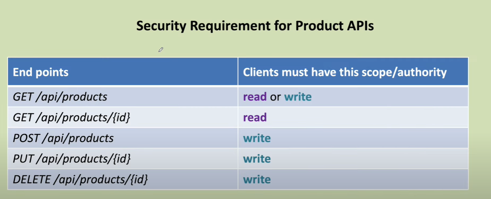
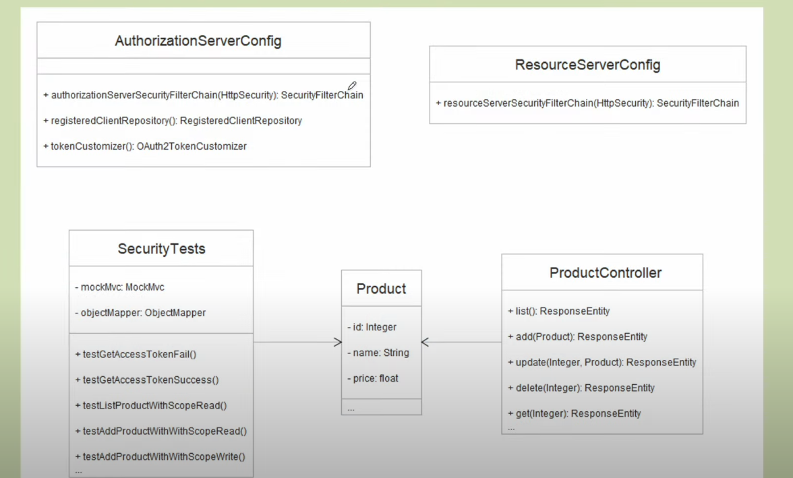
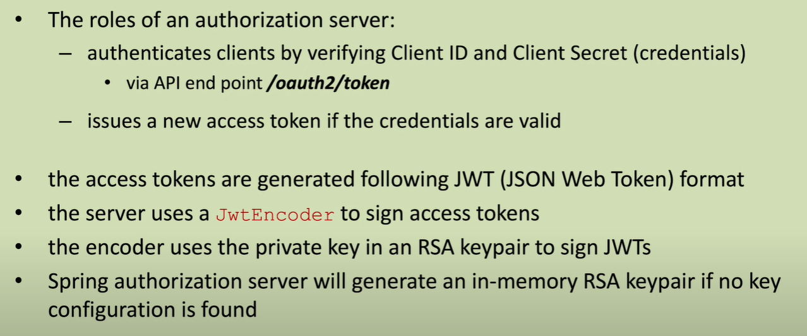
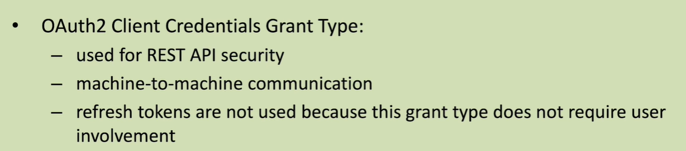
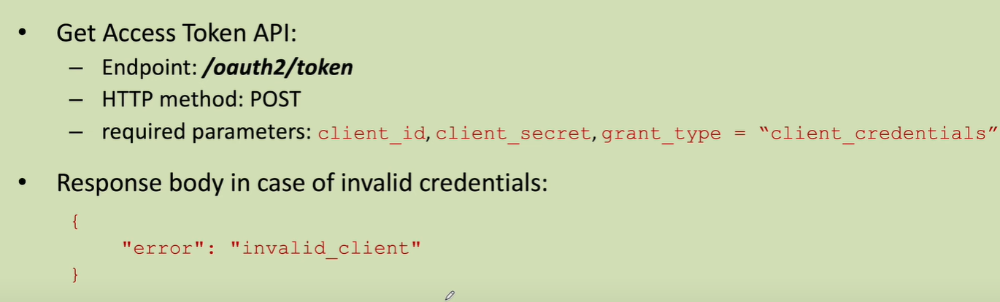

## Link
- [https://youtu.be/hL8ryP6ydFo?list=PLR2yPNIFMlL_RQIjDDyYxIfaecSiRDo_Z](https://youtu.be/hL8ryP6ydFo?list=PLR2yPNIFMlL_RQIjDDyYxIfaecSiRDo_Z)

## In this project

## securing the endpoint

## In the project

## Understand this

## code test get access token fail

### Get Access Token - Know this

