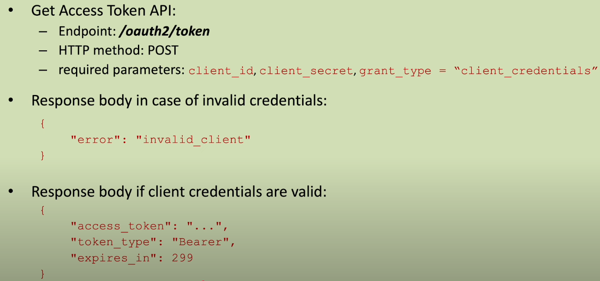

## Write code to test the Get Access Token API

```java
@SpringBootTest
@AutoConfigureMockMvc
class SecurityConfigTest {
    private static final String GET_ACCESS_TOKEN_URL = "/oauth2/token";
    @Autowired MockMvc mockMvc;
    @Test void shouldGetAccessToken() throws Exception {
        mockMvc.perform(post(GET_ACCESS_TOKEN_URL)
                                .param("grant_type", "client_credentials")
                                .param("client_id", "frx290MMt")
                                .param("client_secret", "frank-secret")
                                .param("scope", "read")
                ).andExpect(status().isOk())
                .andExpect(jsonPath("$.token_type", is("Bearer")))
                .andExpect(jsonPath("$.access_token").exists())
                .andExpect(jsonPath("$.access_token").isString())
                .andExpect(jsonPath("$.expires_in").exists())
                .andExpect(jsonPath("$.expires_in").isNumber())  // 299 sec
                .andDo(result -> System.out.println(result.getResponse().getContentAsString()))
                .andDo(print());
    }
    @Test void shouldNotGetAccessToken() throws Exception {
        mockMvc.perform(post(GET_ACCESS_TOKEN_URL)
                                .param("grant_type", "client_credentials")
                                .param("client_id", "frx290MMt")
                                .param("client_secret", "wrong-secret")
                ).andExpect(status().isUnauthorized())
                .andDo(print())
                .andExpect(jsonPath("$.error", is("invalid_client")));
    }
}

```


## Decode the issues access token
- go to [jwt.io](jwt.io)
- paste the token
    - here is a decoded token - sample

- HEADER
```json

{
  "kid": "2083951f-d5d0-4989-8629-cf7bea2d981f",
  "alg": "RS256"
}
```
| Field | Meaning                                                                  |
| ----- | ------------------------------------------------------------------------ |
| `kid` | **Key ID** used to identify which public key to use to verify the token  |
| `alg` | **Algorithm** used to sign the token, here it’s **RS256 (RSA + SHA256)** |

- PAYLOAD
```json
{
  "sub": "frx290MMt",
  "aud": "frx290MMt",
  "nbf": 1747742118,
  "scope": [
    "read"
  ],
  "iss": "http://localhost",
  "exp": 1747742418,
  "iat": 1747742118,
  "jti": "2fcc9e95-eb7d-4eb4-92c3-3d2a7622f983"
}

```

| Claim   | Meaning                                                         |
| ------- | --------------------------------------------------------------- |
| `sub`   | **Subject** – unique user or client ID that the token refers to |
| `aud`   | **Audience** – intended recipient, usually the client ID        |
| `nbf`   | **Not Before** – token not valid before this UNIX timestamp     |
| `exp`   | **Expiration Time** – when token expires (UNIX timestamp)       |
| `iat`   | **Issued At** – when the token was created                      |
| `scope` | **Scope(s)** granted (e.g., read, write access)                 |
| `iss`   | **Issuer** – who issued the token (authorization server URL)    |
| `jti`   | **JWT ID** – unique ID for the token (useful for revocation)    |

- VERIFY SIGNATURE
```text

RSASHA256(

  base64UrlEncode(header) + "." + base64UrlEncode(payload), 
  
  Public Key in SPKI, PKCS #1, X.509 Certificate, or JWK string format ,
  
  Private Key in PKCS #8, PKCS #1, or JWK string format. The key never leaves your browser.

)
```

```text

This proves the token wasn’t tampered with.

The server signs it using the private RSA key.

Clients can verify it using the public key, often exposed via the JWK Set URI (/.well-known/jwks.json).
```


## Popular Auth Servers

```text

| **Authorization Server**        | **Type**           | **Use Case**                                     | **Key Features**                                | **Example Use**                                       |
| ------------------------------- | ------------------ | ------------------------------------------------ | ----------------------------------------------- | ----------------------------------------------------- |
| **Spring Authorization Server** | Self-hosted (Java) | Java apps, full control                          | OAuth2, OIDC, custom flows with Spring Security | Microservices built with Spring Boot                  |
| **Keycloak**                    | Self-hosted (Java) | Enterprise SSO, IAM                              | Admin UI, SAML, LDAP, social login, RBAC        | User login and permissions for a banking portal       |
| **Auth0**                       | Cloud SaaS         | Quick integration, startups, multi-platform apps | OAuth2, OIDC, SAML, social login, MFA           | Auth for a React frontend + Node.js backend           |
| **Okta**                        | Cloud SaaS         | Large orgs, secure workforce apps                | Directory integration, MFA, adaptive auth       | Internal tools in an enterprise (SSO for employees)   |
| **AWS Cognito**                 | Cloud SaaS (AWS)   | AWS-native apps, mobile APIs                     | OIDC, user pools, identity federation           | Login for a serverless mobile app using Lambda        |
| **ORY Hydra**                   | Self-hosted (Go)   | Microservices, cloud-native                      | OAuth2 & OIDC core only, headless               | Auth for distributed services in a Kubernetes cluster |
| **Gluu**                        | Self-hosted        | Enterprise IAM, open-source SSO                  | LDAP, SAML, OIDC, complex IAM policies          | University-wide auth system for students/staff        |
| **ForgeRock**                   | Commercial (Java)  | Fortune 500s, highly regulated sectors           | High-scale IAM, auditing, policy engines        | Telecom or bank handling millions of users            |


```

## say you using a db
