- reference:
  - [https://docs.spring.io/spring-security/reference/servlet/oauth2/login/index.html](https://docs.spring.io/spring-security/reference/servlet/oauth2/login/index.html)

## Using Google

- the flow
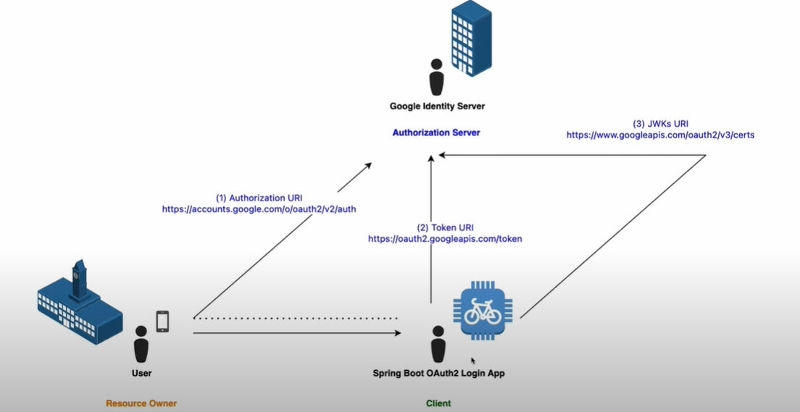

- set the logging
```yml
logging:
  level:
    org.springframework.security: TRACE
```
- check the dependencies
  - by add the oauth2 client we ge this in the console when we run

```text
Will secure any request with filters: 
- DisableEncodeUrlFilter, WebAsyncManagerIntegrationFilter, SecurityContextHolderFilter, 
- HeaderWriterFilter, CsrfFilter, LogoutFilter, UsernamePasswordAuthenticationFilter, 
- DefaultResourcesFilter, DefaultLoginPageGeneratingFilter, DefaultLogoutPageGeneratingFilter, 
- BasicAuthenticationFilter, RequestCacheAwareFilter, SecurityContextHolderAwareRequestFilter, 
- AnonymousAuthenticationFilter, ExceptionTranslationFilter, AuthorizationFilter


```
- at this `localhost:8081` 
  - we are directed to `localhost:8081/login`
    - we see a login form
      - e.g. `DefaultLoginPageGeneratingFilter` is responsible

- now we configure the application to use the OAuth Client for the authentication flow

```yml
spring:
  application:
    name: oauth-client-demo
  security:
    oauth2:
      client:
        registration:
          google:
            client-id: ${google-client-id}
            client-secret: ${google-client-secret}
logging:
  level:
    org.springframework.security: TRACE
server:
  port: 8081

```
- when we run the application this time,
  - we see in the console
    - there are more filters added
      - there are the OAuth2 stuffs

```text
Will secure any request with filters: 
- DisableEncodeUrlFilter, WebAsyncManagerIntegrationFilter, SecurityContextHolderFilter, 
- HeaderWriterFilter, CsrfFilter, LogoutFilter, OAuth2AuthorizationRequestRedirectFilter, 
- OAuth2AuthorizationRequestRedirectFilter, OAuth2LoginAuthenticationFilter, DefaultResourcesFilter, 
- DefaultLoginPageGeneratingFilter, DefaultLogoutPageGeneratingFilter, RequestCacheAwareFilter, 
- SecurityContextHolderAwareRequestFilter, AnonymousAuthenticationFilter, OAuth2AuthorizationCodeGrantFilter, 
- ExceptionTranslationFilter, AuthorizationFilter
```

- so now when we go to `localhost:8081`
  - it automatically redirects us to google
  - note at this point, we dont have any security config

- let add a controller 
```java
@RestController public class HelloController {
    @GetMapping public String hello(@AuthenticationPrincipal OidcUser oidcUser) {
        return """
                Hello %s\s
                Your email is %s\s
                Thank you""".formatted(oidcUser.getFamilyName(), oidcUser.getEmail());
    }
}
```
- we can use open id connect user `OidcUser` because
  - we know the google supports open id connect
  - spring by default send scopes that include open id

- authenticate again, and check the cosole
  - you would see a lot of information
- you can also preserve the log in the network tab of the browser
- take a look at the this  :: consent
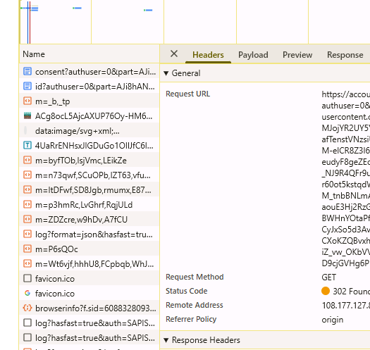

## Using Github

- the flow
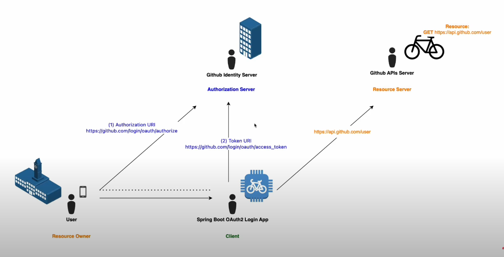

- create a new oauth app in the developer settings of github
```yml
spring:
  application:
    name: oauth-client-demo
  security:
    oauth2:
      client:
        registration:
          github:
            client-id: ${github-client-id}
            client-secret: ${github-client-secret}
logging:
  level:
    org.springframework.security: TRACE
server:
  port: 8081
```

- the controller
```java
@RestController public class HelloController {
  @GetMapping public String hello(@AuthenticationPrincipal OAuth2User oAuth2User) {
    return """
            Hello %s\s
            Thank you""".formatted(oAuth2User.getAttributes());
  }
}
```

- note that we are using `OAuth2User`
  - you can highlight it and do 'ctrl+h'
    - to see the subtypes / hierarchy
      - github uses the traditional auth flow
- now when you start the application, 
  - you will be redirected to github

- take a look at the redirection
```text

https://github.com/login/oauth/authorize
?response_type=code
&client_id=Ov23lie9kPwEigjmdIhM
&scope=read:user
&state=P6yI3-ImisbMgU_-_waaXAybe3BAiY8HUjiniJRNKQ0%3D
&redirect_uri=http://localhost:8081/login/oauth2/code/github
```

- notice the `scope`: it is only `read:user`
  - no open id like for the google
    - so no id token
  - it's not that we are not sending the scope
    - github doesn't support it
- see the output
```
Hello {
login=xxx, 
id=xxxxx, 
node_id=xxxxxxx, 
avatar_url=xxxxxxxxxx, 
gravatar_id=, url=xxxxxxx, 
html_url=https://github.com/frank-jnr-aboagye, 
followers_url=xxxxxxx/followers, 
following_url=xxxxxxx/following{/other_user}, 
gists_url=xxxxxxx/gists{/gist_id}, 
starred_url=xxxxxxx/starred{/owner}{/repo}, 
subscriptions_url=xxxxxxx/subscriptions, 
organizations_url=xxxxxxx/orgs, 
repos_url=xxxxxxx/repos, 
events_url=xxxxxxx/events{/privacy}, 
received_events_url=xxxxxxx/received_events, 
type=User, user_view_type=private, site_admin=false, 
name=xxxxxxx, 
company=null, 
blog=, location=null, email=null, hireable=null, bio=null, twitter_username=null, 
notification_email=null, public_repos=0, public_gists=0, followers=0, following=0, 
created_at=2025-02-11T11:50:50Z, updated_at=2025-05-07T09:28:25Z, private_gists=0, 
total_private_repos=1, owned_private_repos=1, disk_usage=58, collaborators=0, 
two_factor_authentication=false, 
plan={name=free, space=xxxx, collaborators=0, private_repos=10000}
} Thank you
```
## For Both
- we can enable for both
```yml
spring:
  application:
    name: oauth-client-demo
  security:
    oauth2:
      client:
        registration:
          google:
            client-id: ${google-client-id}
            client-secret: ${google-client-secret}
          github:
            client-id: ${github-client-id}
            client-secret: ${github-client-secret}
logging:
  level:
    org.springframework.security: TRACE
server:
  port: 8081
```

- spring supports both

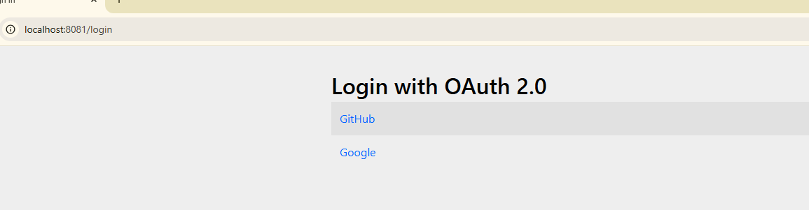


##  OAuth2 Login (JWT): Explained!
- What is happening behind the scenes

- [https://datatracker.ietf.org/doc/html/rfc6749#section-4.1](https://datatracker.ietf.org/doc/html/rfc6749#section-4.1)
- [https://openid.net/specs/openid-connect-core-1_0.html#CodeFlowAuth](https://openid.net/specs/openid-connect-core-1_0.html#CodeFlowAuth)

### Authorization code grant
```text
     +----------+
     | Resource |
     |   Owner  |
     |          |
     +----------+
          ^
          |
         (B)
     +----|-----+          Client Identifier      +---------------+
     |         -+----(A)-- & Redirection URI ---->|               |
     |  User-   |                                 | Authorization |
     |  Agent  -+----(B)-- User authenticates --->|     Server    |
     |          |                                 |               |
     |         -+----(C)-- Authorization Code ---<|               |
     +-|----|---+                                 +---------------+
       |    |                                         ^      v
      (A)  (C)                                        |      |
       |    |                                         |      |
       ^    v                                         |      |
     +---------+                                      |      |
     |         |>---(D)-- Authorization Code ---------'      |
     |  Client |          & Redirection URI                  |
     |         |                                             |
     |         |<---(E)----- Access Token -------------------'
     +---------+       (w/ Optional Refresh Token)

   Note: The lines illustrating steps (A), (B), and (C) are broken into
   two parts as they pass through the user-agent.

                     Figure 3: Authorization Code Flow

```
### let's explore

- we go to `DefaultAuthorizationCodeTokenResponseClient.java`
  - search for the class and add a break point
    - you will need to download the source
    - maybe it has been deprecated

- take a look
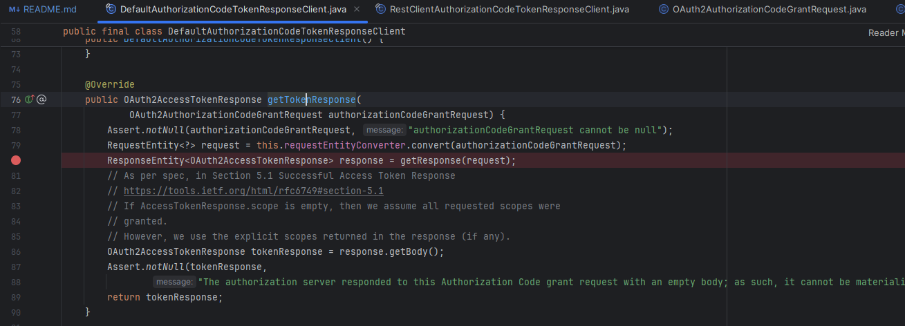

- you can go to the newer implementation and put a break point there
- you wil see that it
  - get the code
    - then exchanges it for a token
    - and now the token can be used at the resource server level


## Authorization Code Grant with Github
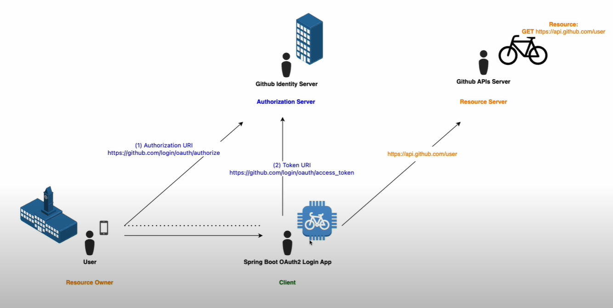


### gihub authorizing oauth app
- [https://docs.github.com/en/apps/oauth-apps/building-oauth-apps/authorizing-oauth-apps](https://docs.github.com/en/apps/oauth-apps/building-oauth-apps/authorizing-oauth-apps)

### scope for oauth apps
- [https://docs.github.com/en/apps/oauth-apps/building-oauth-apps/scopes-for-oauth-apps](https://docs.github.com/en/apps/oauth-apps/building-oauth-apps/scopes-for-oauth-apps)

### rest api endpoint for users
- [https://docs.github.com/en/rest/users/users?apiVersion=2022-11-28#get-the-authenticated-user](https://docs.github.com/en/rest/users/users?apiVersion=2022-11-28#get-the-authenticated-user)


## Testing in postman

- after the GET request with this 
  - make the request in the browser
    - just put the link in there and preserve log
```http request
https://github.com/login/oauth/authorize
    ?response_type=code
        &client_id=Ov23lie9kPwEigjmdIhM
        &scope=read:user
        &state=tdSaUzXz9Q-dATfQKRLkzzCErjzxBJQttJqQdLV_Ye0%3D
        &redirect_uri=http://localhost:8081/login/oauth2/code/github
```

- stop the spring app
  - put the url in the browser, since the postman cannot do the redirect
- you see we get this

```http request
http://localhost:8081/login/oauth2/code/github
    ?code=7ab21bdaa5bdeafa8caa
        &state=tdSaUzXz9Q-dATfQKRLkzzCErjzxBJQttJqQdLV_Ye0%3D
```

- you see we get a code
- we have the same state

- so now we can exchange the code for a token 
  - via the token url

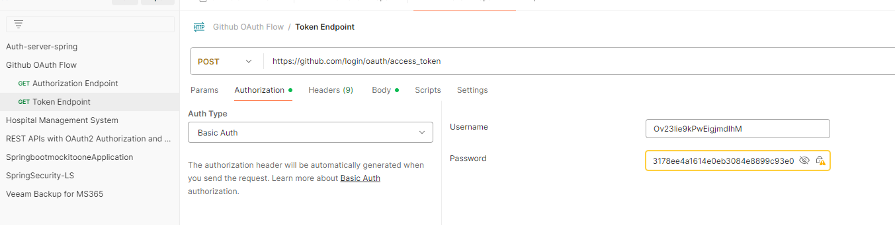

- the username and password for the basic auth
  - is the client id and secret

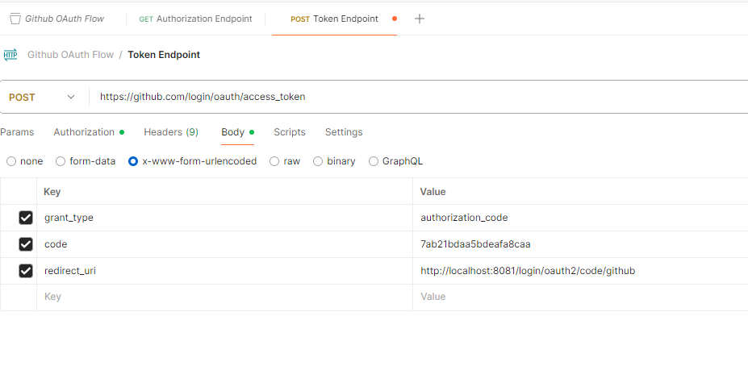

- header should accept
  - application/json

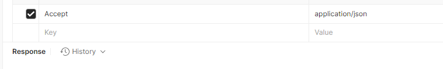

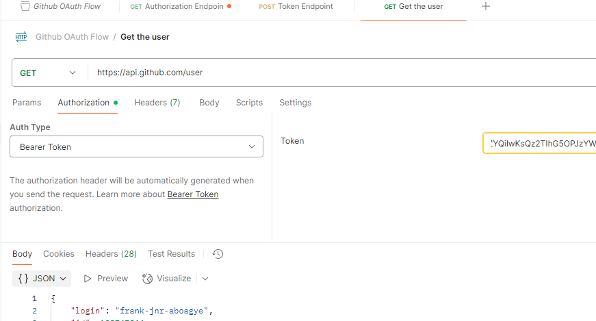


- the complete response can be found here
[./postmanresponse/response-get-user.json](./postmanresponse/response-get-user.json)


## Complete Provider
- so now we know the response
  - now we can finalise the user login process
    - create a user session
      - so once the user accepts, it wont trigger the flow anymore

- let do it - using the authorization server

```yml
        registration:
        provider:
            my-github:
                <all the available properties for a provider comes here>
```

- since we know the flow, whe know which properties are needed

- look here

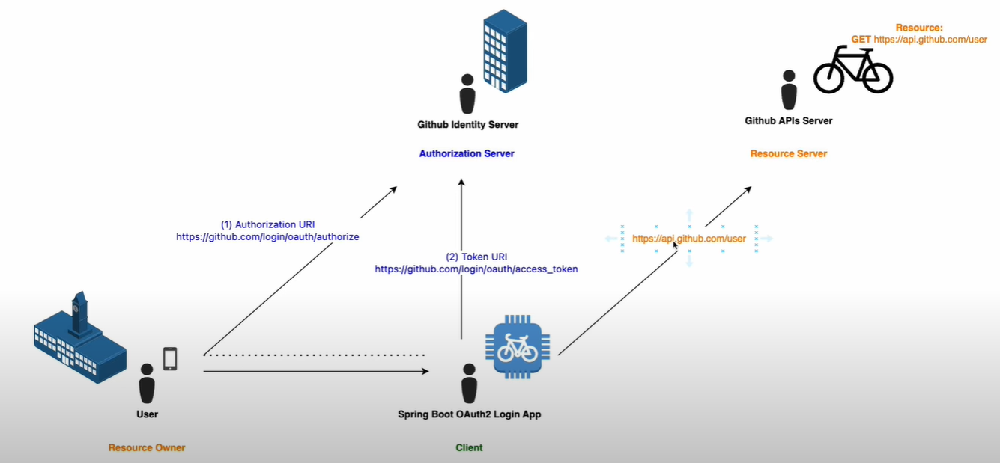

- so we see from the flow, that we need

```text
authorization-uri
token-uri
user-info-uri
```

- an important thing is the `user-name-attribute`
  - the thing we want as our username
  - we choose something that is unique .. like "sub, or email, or id or ..<something unique>"

- when you check the response from github in the json
  - you will see that, `id` is / will be unique
  - `login` is also unique

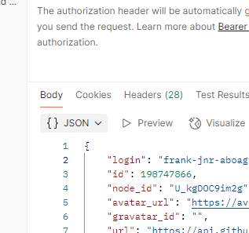

[./postmanresponse/response-get-user.json)](./postmanresponse/response-get-user.json)

- so we will set the `user-name-attribute` to id

```java
@GetMapping public String hello(@AuthenticationPrincipal OAuth2User oAuth2User) {
  return """
          Hello %s\s
          Thank you""".formatted(oAuth2User.getName());  // the id will be here 
}
```

- for client-authentication-method
  - search for  `ClientAuthenticationMethod.java` and download the source
    - "client_secret_basic" i think that is the default
- for authorization grant type
  - search for it as well
    - `AuthorizationGrantType.java` and download the source
      - you will see `authorization_code`
        - that is what we are doing so .. yh

```yaml

spring:
  application:
    name: oauth-client-demo
  security:
    oauth2:
      client:
        provider:
          my-github:
            authorization-uri: https://github.com/login/oauth/authorize
            token-uri: https://github.com/login/oauth/access_token
            user-info-uri: https://api.github.com/user
            user-name-attribute: id
#            user-name-attribute: login
        registration:
          complete-github-registration:
            provider: my-github
            client-id: ${github-client-id}
            client-secret: ${github-client-secret}
            scope:
              - read:user
            redirect-uri: http://localhost:8081/login/oauth2/code/github
            client-authentication-method: client_secret_basic
            authorization-grant-type: authorization_code
            client-name: complete github client registration
```


- output
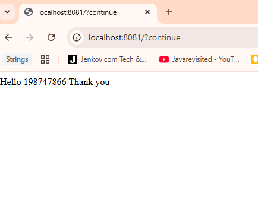


- we also have a session now

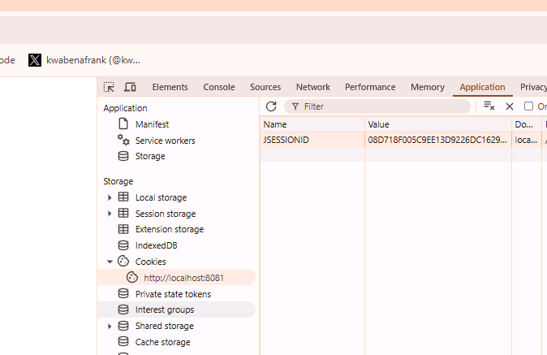

- you can put a break point at the
```java
HttpSessionSecurityContextRepository.java
        |__readSecurityContextFromSession() // this is what is being reference
            // so that in case the user is already accepted (with the OAuth2, we just use that session)

-> so the auth flow doesn't need to trigger everytime
```

- But why does the previous ones work, like the gihub and the google we used
  - yes spring has some common providers built in already that is why the google and the github
    - worked liked this

```yml

        registration:
          google:
            client-id: ${google-client-id}
            client-secret: ${google-client-secret}
          github:
            client-id: ${github-client-id}
            client-secret: ${github-client-secret}


```

- check the `CommonOAuth2Provider.java` and download the source
  - you will see
    - `GOOGLE`, `GITHUB`, `FACEBOOK`,`OKTA`
    - with its characteristics have been set /auto configured
      - the authorization-uri, token-uri, e.t.c


### Using postman's OAuth2
- in the authorization
  - select the OAuth2 
    - set them like the way we did for spring boot


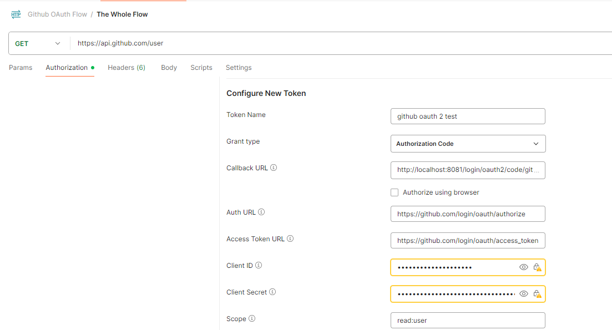

- there is a pop up to log into github
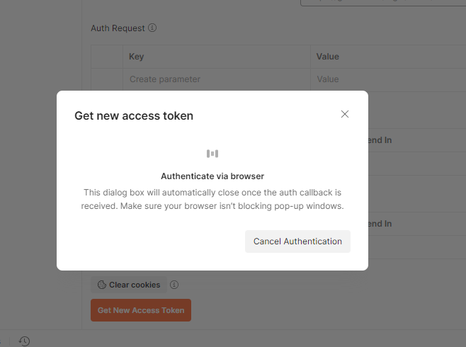

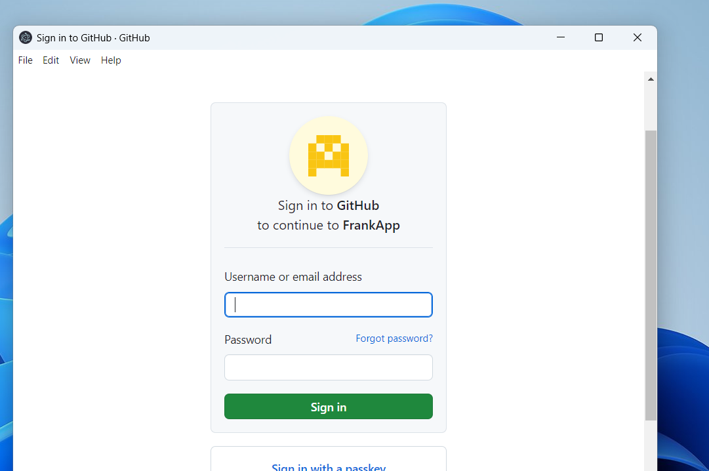

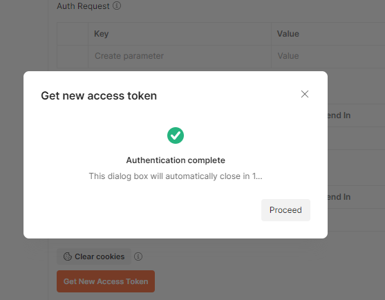

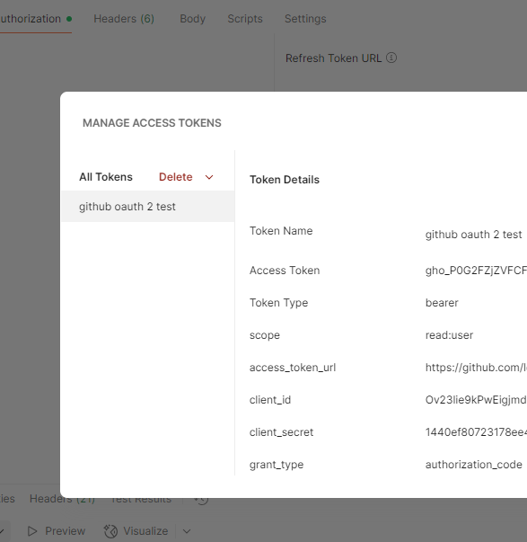


- you can use the token
  - click on send
    - i.e. making the request for the user info `https://api.github.com/user`
      - success response

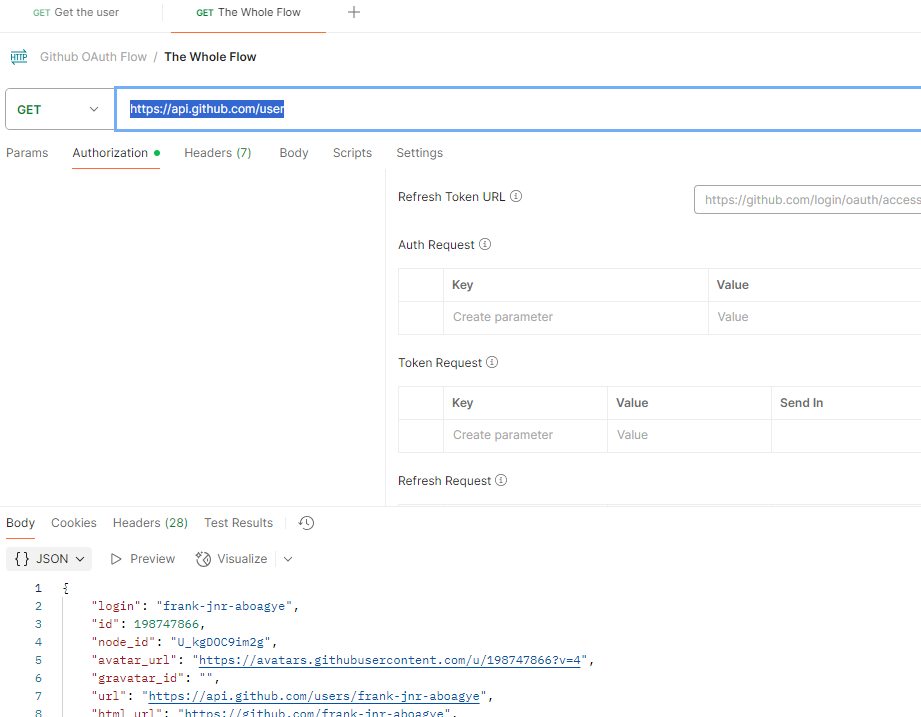


---

## Spring Security OAuth2 Login (JWT) with Google (OpenId Connect Flow) - Complete Configuration


- with the JWKs URI
  - the JWKs URI (JSON Web Key Set URI) plays a very important role in verifying that the JWT (ID token) from Google is genuine and hasn't been tampered with

```text
When you configure a spring.security.oauth2.client and Spring detects it's an OpenID Connect provider (like Google), it automatically fetches:

.well-known/openid-configuration (which includes the jwks_uri)

Then uses the jwks_uri to download the keys

OpenID Connect Discovery Document
e.g https://accounts.google.com/.well-known/openid-configuration
```
---

## Spring Security OAuth2 Login (JWT) x Spring Authorization Server x Proof Key for Code Exchange(PKCE)

- Types of OAuth2 Flows (Grant Types)

| Grant Type                    | When to Use                           | Description                                                |
| ----------------------------- | ------------------------------------- | ---------------------------------------------------------- |
| **Authorization Code**        | Web apps with backends                | Uses browser redirect flow, with code exchanged for tokens |
| **Authorization Code + PKCE** | SPAs or mobile apps                   | Safer version of above, for public clients                 |
| **Client Credentials**        | Server-to-server                      | No user involved, just apps talking                        |
| **Password (deprecated)**     | Internal apps only                    | User provides username & password directly                 |
| **Refresh Token**             | Get new access token without re-login | Sent with `refresh_token` grant                            |


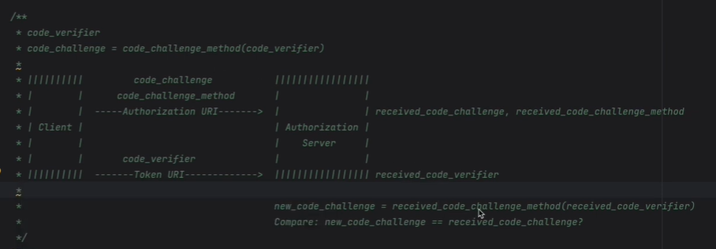


---

## Simple Project
- An auth server that will support open id  + PKCE
  - refer to the `Auth Sever Demo Project`


# Continue after Auth Sever Demo Project

---

- this continues from the auth-server-demo

- so we just add this

```yaml
my-inhouse-authourization-server:
  issuer-uri: http://localhost:9000
  user-name-attribute: sub

# then register
    my-inhouse-authourization-server: # since its the same name, I dont have to bring the provider
      client-id: ${in-house-client-id}
      scope:
        - openid
        - profile
      redirect-uri: http://127.0.0.1:8081/login/oauth2/code/x-pcke-client-x
      client-authentication-method: none
      authorization-grant-type: authorization_code
      client-name: my-inhouse-authourization-server

```

- Note
  - spring strictly follows the openid and oauth2 configurations and
  - recommendations such that, we only need the issuer-uri
  - and it will use its `.well-known/openid-configuration`
    - to configure the rest
    - so we dont have to explicitly list the
```text
            authorization-uri
            token-uri
            user-info-uri
```

- then we run it

```text
127.0.0.1:8081

// remember why we're using the 127.0.0.1 
instead of the localhost
> the authorization server is running on localhost:9000

// and there will be two cookie session based on the domains

```

- see it is available
- note that the authorization server is also running

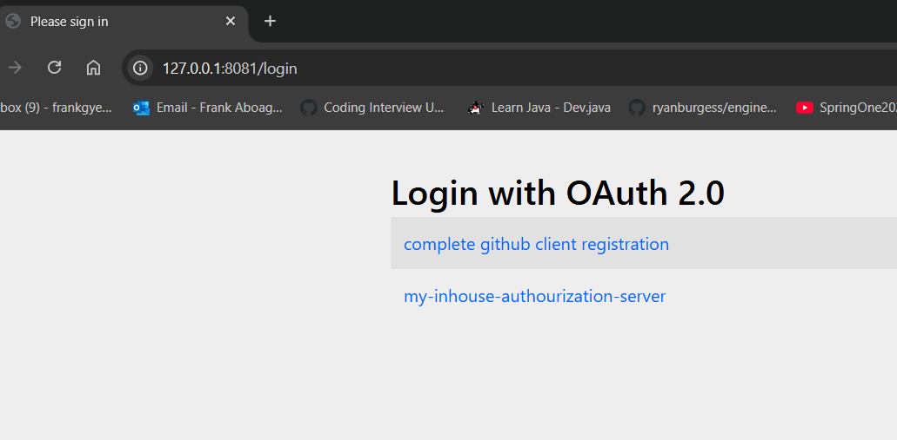

- then it redirects me

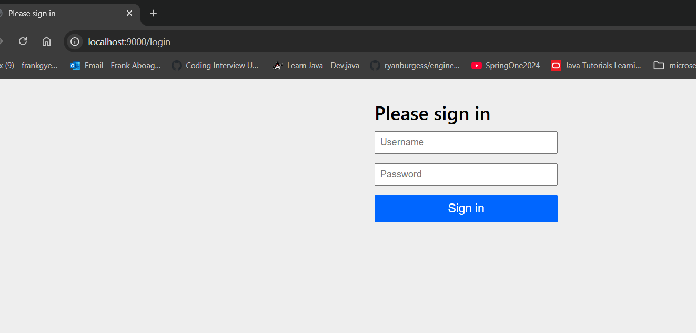

- we know the user 
  - check the auth server demo (application.yml)
```text
    user:
      name: kb@scale.com
      password: uia889nf

```
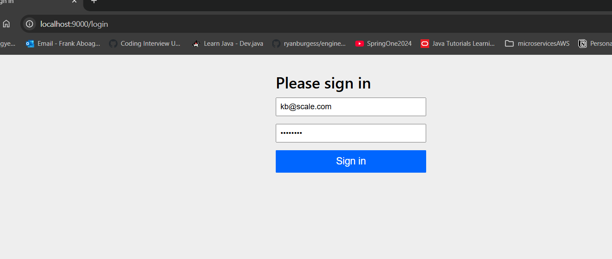

- then we are redirected agian to the spring boot app.


