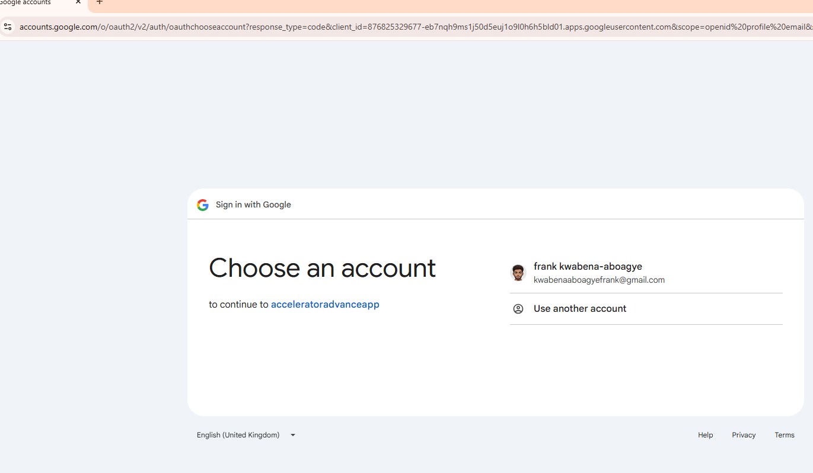
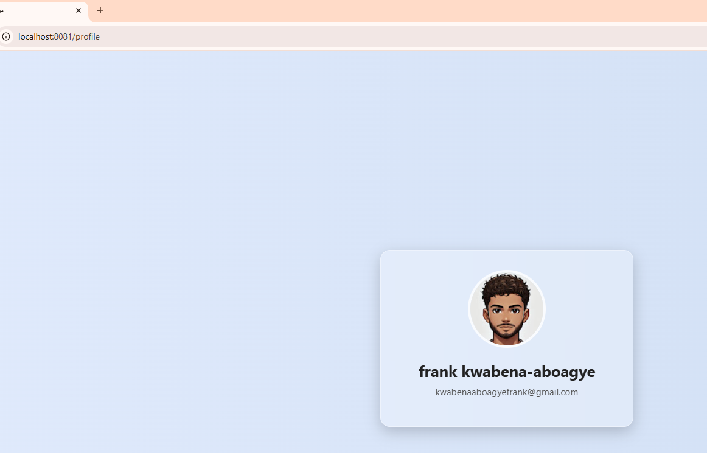

## OAuth2 Social Login with Spring Security | 'Sign in with Google' Spring Boot Tutorial
- by: Genuine Coder
- link: [https://youtu.be/tIaWE9WthSQ](https://youtu.be/tIaWE9WthSQ)


## Configurations
- we need two things
  - google client id
  - google client secret

### we create that in the google cloud console
  - create a new project - e.g. `acceleratorproject001`
  - go to `credentials` under `api and services` -> then `OAuth Client ID`
  - 
  - you configure consent screen
  - you can proceed to 
    - add or remove scopes
    - 
  - you can give test users for testing
    - 
  - now we add the cedentials
    - By default, Spring Boot uses the redirect URI  `http://localhost:8081/login/oauth2/code/google`
    - Make sure to register this URI in the Authorized redirect URIs section of your Google API Console
    - 
    - 
  - download the json

- configure the properties
  - 

- Enable the web security
  - `@EnableWebSecurity`

- controller

```java
@RestController public class MainController {
    @RequestMapping("/") public String home() {return "Welcome to this tutorial";}

    @RequestMapping("/user") public Principal user (Principal user) {  // we'll return the details of a logged in user here
        return user;
    }
}

```

- login configuration
  - using the defaults now

```java
@Configuration public class SecurityConfig {
    @Bean public SecurityFilterChain securityFilterChain(HttpSecurity http) throws Exception {
        http.authorizeHttpRequests(
                authorizeRequests ->
                        authorizeRequests
                                .requestMatchers("/").permitAll()
                                .anyRequest().authenticated()
                ).oauth2Login(Customizer.withDefaults())
                .formLogin(Customizer.withDefaults());
        return http.build();
    }
}
```

- 

- login route
  - we see the default form
    - 
  - now we can login with our test google users and go to the `/user` endpoint :: which is secured and demand that we login, so we are going to use google
    - so we login with the google
    - note that on the button , it redirects to `localhost:8081/oauth2/authorization/google`
      - 
    - When I click on the google, this is the url now
```text
https://accounts.google.com/o/oauth2/v2/auth/oauthchooseaccount?response_type=code&client_id=876825329677-eb7nqh9ms1j50d5euj1o9l0h6h5bld01.apps.googleusercontent.com&scope=openid%20profile%20email&state=TWsryobzf9GFR1D0IQd5XudGcddXpNFEIAT8zGtP80Y%3D&redirect_uri=http%3A%2F%2Flocalhost%3A8081%2Flogin%2Foauth2%2Fcode%2Fgoogle&nonce=FYvae7o9007cPZY4a9L16JN5EMHqqMqtL5FaT2X7Cd0&service=lso&o2v=2&flowName=GeneralOAuthFlow
```


- note the name of the application
- select the google user
- now this is the url

```text
https://accounts.google.com/signin/oauth/id?authuser=0&part=AJi8hANoG-8Q5ITdNuWyj28ej_9al3Eao9PnVtwkQuf9ij2cI5pNNGNmaG_EX9W5tRrbM2yzlm-VlZY-OrCmMDoeH7QFOLruh7InsrLq-5gPuIiALT35YH_CvwvacFuSmvoOsm70GiWScP4kfe8ZrGkN9vAxkxd1Tyd5ETmRzt4CAUpMV1kY88vZ22vcdKjvzUcW6evHzhS9XCsUstsgqlbD7lB0fGlQN6qwmguHejy4nnWjhQiv1FYXxmN73lAXvbOqTXKr6-MP0HkwQ5yqxxnfXXCPlsXTmZmjy6z84P_B7fj7yNU_VDDFkFjHCF15XzuxAkM0iYOievK4VdsfKkDHex4kQT2BwVYCH0moqb20gMDG3Tjk7ag3gls78aTVArUIQkQEBp05K-t9W-8Mk_R71RGjPe-T3qPE7WIPr4_JAHCVZHVuhkDCZeJOXPieVZ4zZsmVU7706tn-MYv2DBR3oQ6yABe1c65zM7D8fygpaZ7orSMhCiA99b8Q5KLUik8WYf32yNNzY2sWMM2jYz6SZIy_b1ZVHNc5iI_A65hu6W8PBf8UjZk5DCxYLazdJzs5o8TTKaDOX4HZXNnevnoCDfW1GDr1X0UiTIJA3ZOJjXjV7PNtOgBw08216Ltwjz87KFR3X_KCSqe-2j4QYXrRnziJvr2pUmbPfe9GJJ3Ddq6FYRXdAQUKCEGr81N7-9f5bCkd7fgBSXN95c-pa0QMi9VE_cpBDQ9k27OMj2B0dZJOLm_K3hIfJIxoarINv4Opbi1HMSd_zxALd1w-uYyxYEG6IkD3e-eVgADZldO_ZqhYnJjOxQ1XObd6VHLC2WoizmnlzJOHVjnGptp87CF-B-WB8Ma5iA&flowName=GeneralOAuthFlow&as=S-2076933416%3A1748001081078749&client_id=876825329677-eb7nqh9ms1j50d5euj1o9l0h6h5bld01.apps.googleusercontent.com&rapt=AEjHL4NDK-VTDjPseShOD6yXtpqQmd644-LF9YHPHfO5dJA1_D_pKO9RXUSMXUBKwueQWQmTex9MzlPZg9ytVRJdBExOWepSAQ#
```


- we click in `continue`
- and now we have our page
  - note: in the code we just returned the `principal`
    - that's why we see that json
    - 

- the whole principal output can be found here
- [./secrets/principaloutput.json](./secrets/principaloutput.json)

### profile Page for logged in user
  - once a user is logged in, we will direct to `/profile` page
    - we display, the name, the email and profile picture of the user
  - the `user-profile.html` can be found here
  - 
  - we then create a `controller` not a rest controller !!
- view the controller below
```java
@Controller public class ViewController {
    @GetMapping("/profile") public String getProfile(OAuth2AuthenticationToken  token, Model model) {
        Map<String, Object> attributes = token.getPrincipal().getAttributes();
        model.addAttribute("name", attributes.get("name"));
        model.addAttribute("email", attributes.get("email"));
        model.addAttribute("photo", attributes.get("picture")); 
        return "user-profile";
    }
}
```

- now when we login with google and go to the `profile` route, here is the output
- 

- redirect the user to the `profile` automatically

```java
@Configuration public class SecurityConfig {
    @Bean public SecurityFilterChain securityFilterChain(HttpSecurity http) throws Exception {
        http
                .authorizeHttpRequests(authorizeRequests ->
                        authorizeRequests
                                .requestMatchers("/").permitAll()
                                .anyRequest().authenticated()
                )
                .oauth2Login(oauth2login -> {
                    oauth2login.successHandler((request, response, authentication) -> response.sendRedirect("/profile"));
                })
                .formLogin(Customizer.withDefaults());
        return http.build();
    }
}

```

### custom social login button
  - the only thing we need is the url it makes the request to
  - 
  - the `custom-login.html` can be found here
    - 

  - we link the login into the configuration
```java
@Configuration public class SecurityConfig {
    @Bean public SecurityFilterChain securityFilterChain(HttpSecurity http) throws Exception {
        http
                .authorizeHttpRequests(authorizeRequests ->
                        authorizeRequests
                                .requestMatchers("/", "/login").permitAll()
                                .anyRequest().authenticated()
                )
                .oauth2Login(oauth2login -> {
                    oauth2login.loginPage("/login");
                    oauth2login.successHandler((request, response, authentication) -> response.sendRedirect("/profile"));
                });
        return http.build();
    }
}

```