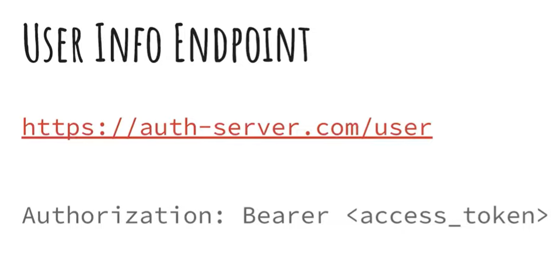
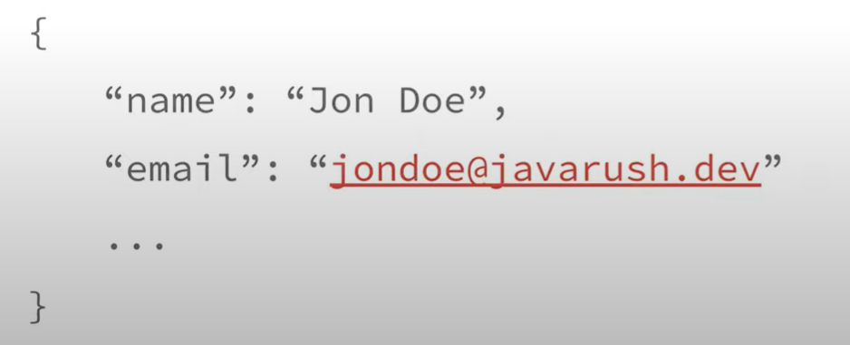
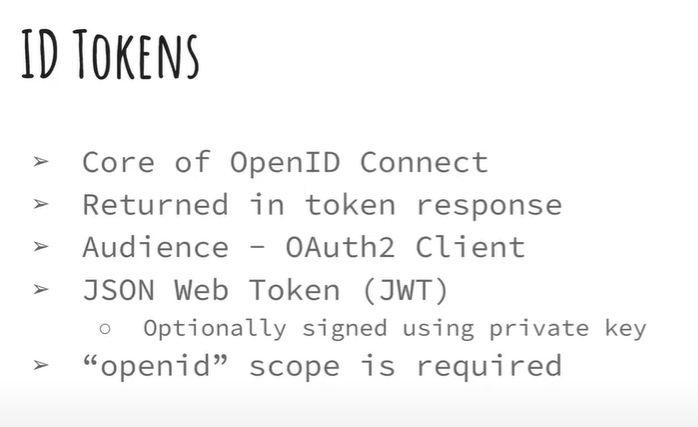
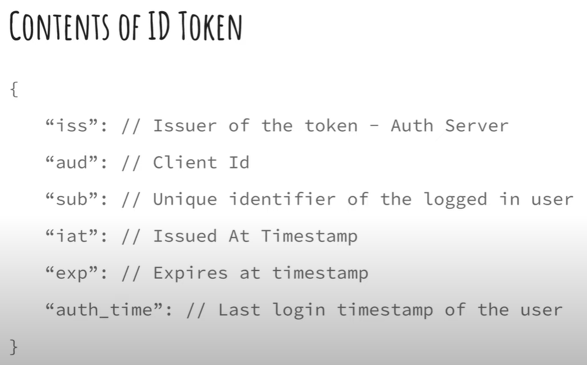
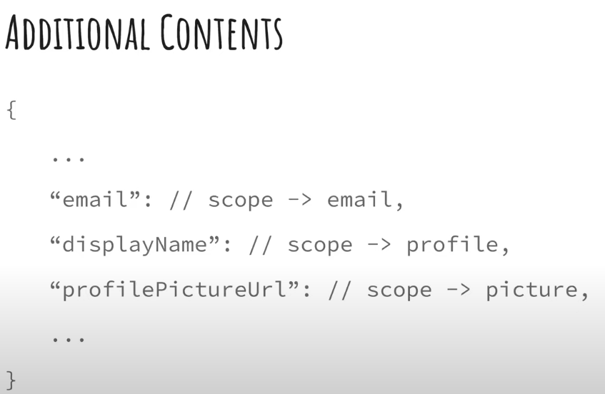

## OpenID Connect: Everything You Need to Know + Spring Boot Implementation
- by: Java Rush
- link: https://youtu.be/eY0Qo5Rgs3M

## We start
- What is openid
  - oauth2 + identity layer
  - gives information about the user 
  - Note the for oauth2, there isn't a direct info about the user
    - we only get what the user can do and cannot do
  - but sometimes we need to know the user information
    - or better still the client need to know / display some user information

- Ways to implement the implement the open id protocol
  - `idtoken` and `user info endpoint`
  - most of the times in authorization servers you implement both of these methods

- Based on the documentation
  - we can go to a user endpoint
  - pass in the Authorization like this
  
  - the authorization server will send us back the following information
    - there could be more
    

### ID Tokens
- they are the core of the open id connect
- they are returned in token response along with the 'access tokens'
- the audience to te id token is = OAuth2 client
  - note:: not the oauth2 resource server
- id token are always JWT (Json Web Tokens)
  - note:: access tokens can be JWT (non opaque) or opaque
    - but id tokens are always JWT
    - id token may be optionally signed using private key
- to get / generate the id token
  - the `openid` scope is required

### contents of the id token

- the auth server documentation will need to capture this for the additional content

