## Continuation from the auth-client-demo

# Spring Security OAuth2 Login (JWT) x Spring Authorization Server x Proof Key for Code Exchange(PKCE)

- Check the spring docs for the minimum required things we need
```yml
https://docs.spring.io/spring-authorization-server/reference/getting-started.html

server:
  port: 9000

logging:
  level:
    org.springframework.security: trace

spring:
  security:
    user:
      name: user
      password: password
    oauth2:
      authorizationserver:
        client:
          oidc-client:
            registration:
              client-id: "oidc-client"
              client-secret: "{noop}secret"
              client-authentication-methods:
                - "client_secret_basic"
              authorization-grant-types:
                - "authorization_code"
                - "refresh_token"
              redirect-uris:
                - "http://127.0.0.1:8080/login/oauth2/code/oidc-client"
              post-logout-redirect-uris:
                - "http://127.0.0.1:8080/"
              scopes:
                - "openid"
                - "profile"
            require-authorization-consent: true
```

- or use the how to guide
[https://docs.spring.io/spring-authorization-server/reference/guides/how-to-pkce.html](https://docs.spring.io/spring-authorization-server/reference/guides/how-to-pkce.html)

- We are going to be using the pkce

- dependencies
  - web, authorization server
- just like google / github,
  - we need to register the client

- view thw application.yml
[./src/main/resources/application.yml](./src/main/resources/application.yml)

```text
from the above
- since we are going to be using pcke
    - no client secret is needed
    - client authentication-method is also none
    - we take off the refresh token
    
 - take note of the redirect uris
    - note that "127.0.0.1" is being used instead of "localhost"
    - this is important for the demo
        - one session for the authorization server
        - another session for the spring boot app
      - they will be stored in the cookie and separated by domain
      - so we can't use same domain name for both
        - for our spring boot app: we use: 127.0.0.1
        - for the authorization server: we use: localhost
        
 - the user
    - means the user of the authorization sever
```

### the Provider Configuration
[https://openid.net/specs/openid-connect-discovery-1_0.html#ProviderConfig](https://openid.net/specs/openid-connect-discovery-1_0.html#ProviderConfig)
- in the open id specification
  - you have to provide the provider configuration
  - so spring also adheres to that 

```text
OpenID Providers supporting Discovery 
MUST make a JSON document available at the path formed by 
concatenating the string /.well-known/openid-configuration to 
the Issuer
```

- same as what google has done
```http request
https://accounts.google.com/.well-known/openid-configuration
```

- for us also
```text
we are the issuer at localhost:9000

so it must be at 
localhost:9000/.well-known/openid-configuration
- spring helps us to do this - WOW!
```

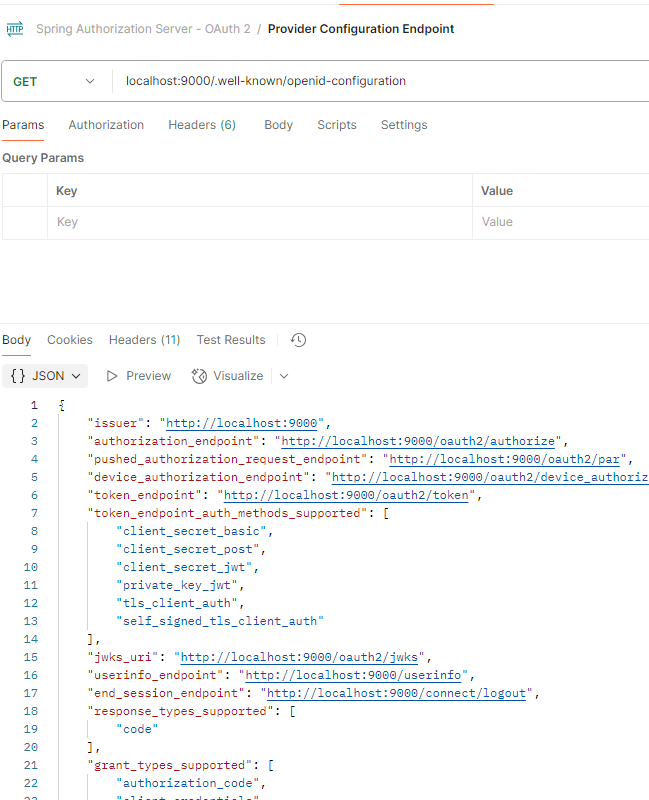


- we take the authoirization end point and use the postman to test

- so the client will use the above information
for reference
- note
```text

The nonce (short for "number used once") is:
A random value generated by the client application (usually a cryptographically secure string).
Sent in the authorization request to the authorization server.
Included in the ID Token returned from the server.
Used to verify that the ID Token belongs to the same authentication request that initiated the login.

```

## testing with postman - to the authorization endpoint
- look at the postman

- we generate a code challenge
- check this
[./src/test/java/org/example/authserverdemo/PCKETests.java](./src/test/java/org/example/authserverdemo/PCKETests.java)
```java
    @Test
    void createCodeChallenge() throws NoSuchAlgorithmException {
        String codeVerifier = "abc";
        String codeChallengeMethod = "SHA-256";

        MessageDigest md = MessageDigest.getInstance(codeChallengeMethod);
        byte[] digest = md.digest(codeVerifier.getBytes(StandardCharsets.US_ASCII));

        String  codeChallenge = Base64
                                    .getUrlEncoder()
                                    .withoutPadding()
                                    .encodeToString(digest);

        System.out.println("== Code Challenge ==");
        System.out.println(codeChallenge);
    }

```
- look at the rest from the provider config endpoint

- so now we make the request to the authorization endpoint
```http request
GET localhost:9000/oauth2/authorize
    ?response_type=code
        &client_id=x-pcke-client-x
        &scope=openid profile
        &state=randomstringhere123
        &redirect_uri=http://127.0.0.1:8081/login/oauth2/code/frank-client-app
        &nonce=def233
        &code_challenge=ungWv48Bz-pBQUDeXa4iI7ADYaOWF3qctBD_YfIAFa0
        &code_challenge_method=S256
```
- lets do it with the browser
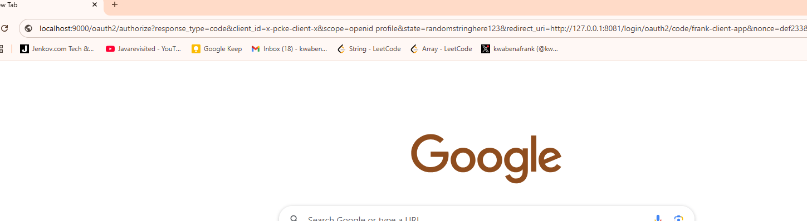

- it redirects to the authorization server login page

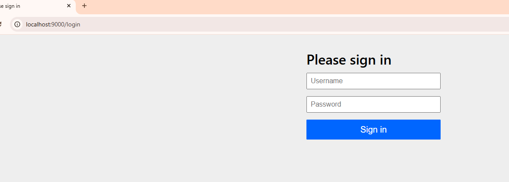

- now we use login details of the configured users
  - check the application.yml
```yml
spring:
  ...
  security:
    user:
      name: kb@scale.com
      password: uia889nf
    ...

```

- we move to the consent page
  - look at the url too
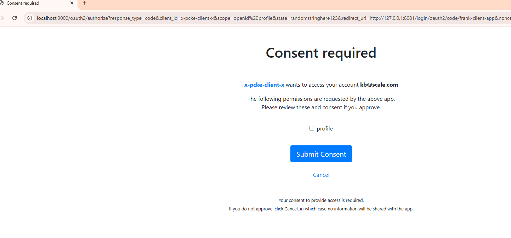

```http request
http://localhost:9000/oauth2/authorize
    ?response_type=code
        &client_id=x-pcke-client-x
        &scope=openid%20profile
        &state=randomstringhere123
        &redirect_uri=http://127.0.0.1:8081/login/oauth2/code/frank-client-app
        &nonce=def233
        &code_challenge=ungWv48Bz-pBQUDeXa4iI7ADYaOWF3qctBD_YfIAFa0
        &code_challenge_method=S256&continue
```

- once we submit the request, we are successfully redirected 
  - look at the link as well
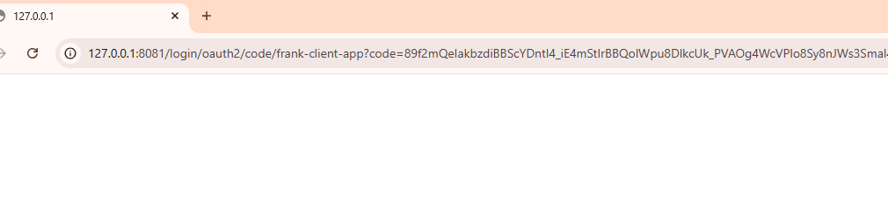

```http request
http://127.0.0.1:8081/login/oauth2/code/x-pcke-client-x
    ?code=vXEtG_-WUiDdTBKZdQQJnaLyeEKVbkCr3KSn_QFo2SgtSqJcT3Q1G9A8oZsIgo-kCTeGsCXNoWQxZKE7tggaWl-VxAxYf7Qn0tiL6cF3s4RZtRarLdBw-k6_iDUDLU4t
        &state=randomstringhere123

```

- so you see we get the code and the state

- so we use this code and send a post to our token endpoint

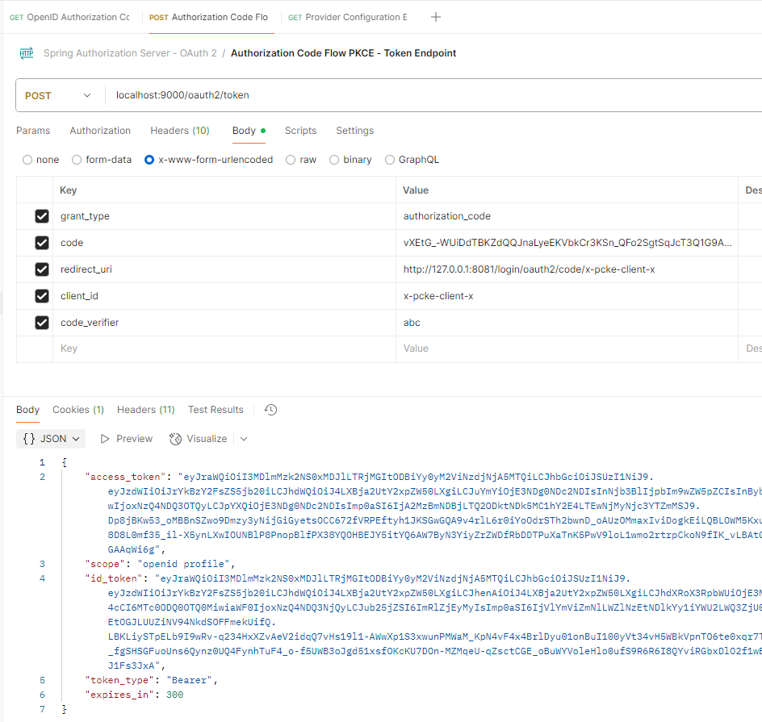


- so we get the response

```json
{
    "access_token": "eyJraWQiO...HXvMlg8DCyIGAAqWi6g",
    "scope": "openid profile",
    "id_token": "eyJraWQi...RjI-KKJ1Fs3JxA",
    "token_type": "Bearer",
    "expires_in": 300
}
```

- so we can decode the `id_token` at [jwt.io](jwt.io)
- we see the the subject `sub`

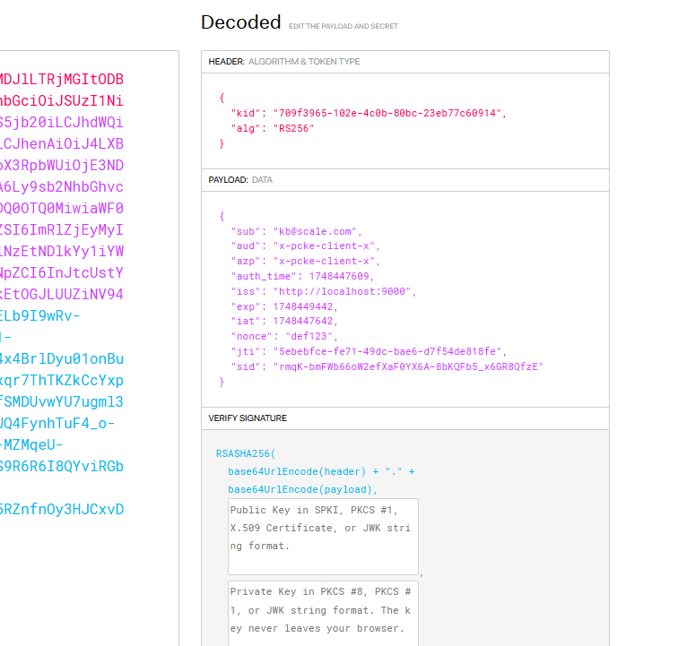
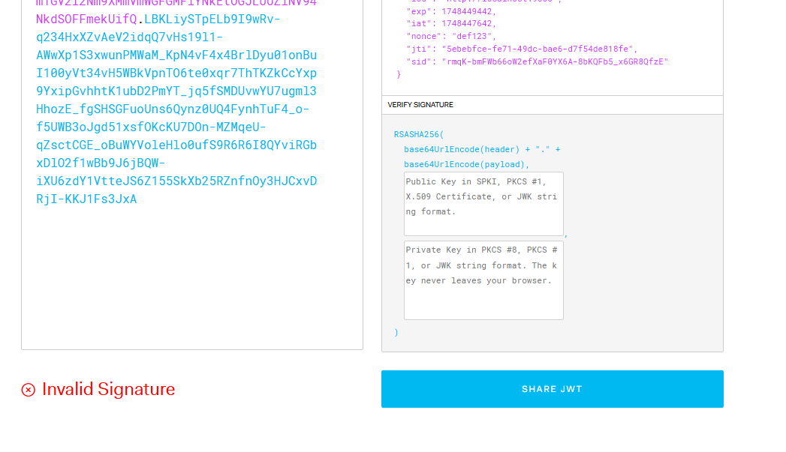

- but we have invalid signature
  - we need to provide the public key of out authorization server to verify that

- so as usual, we check the 

```http request

GET localhost:9000/.well-known/openid-configuration

```
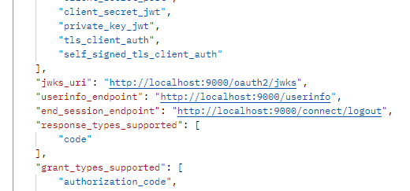

- this is what we get

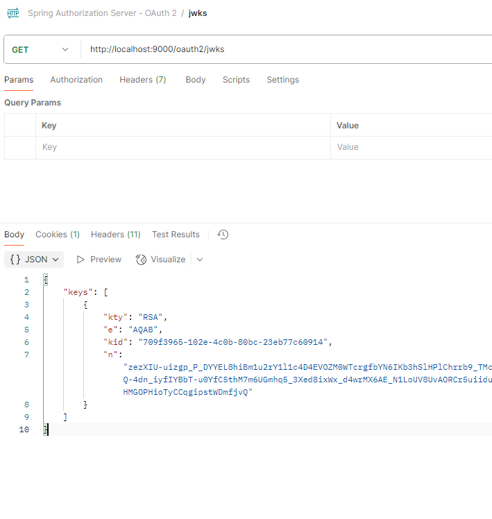

- we copy the ff and verify it in the `jwt.io`
```json
{
  "kty": "RSA",
  "e": "AQAB",
  "kid": "709f3965-102e-4c0b-80bc-23eb77c60914",
  "n": "zezXIU-uizgp_P_DYYEL8hiBm1u2rY1l1c4D4EVOZM0WTcrgfbYN6IKb3hSlHPlChrrb9_TMcAWNE8_-4PVeApMin9LMlSS3HXC4KQp86ba4lHHaM9mmPGrHagIPxzNVMhicS5cXSoEO6e4P9ZLcO71gSUaDWqQ-4dn_iyfIYBbT-u0YfC5thM7m6UGmhq5_3Xed8ixWx_d4wrMX6AE_N1LoUV8UvAORCr5uiiduRs5Z7jzoq2-eceYjsa57WtoOKOxPoxs2WUGPb-isgVzw9PYz9xgIBy4FhmA6bVUm353mswgWetdVADCYbRzfaHMGOPHioTyCCqgipstWDmfjvQ"
}
```

- now we see that the SIGNATURE is verified

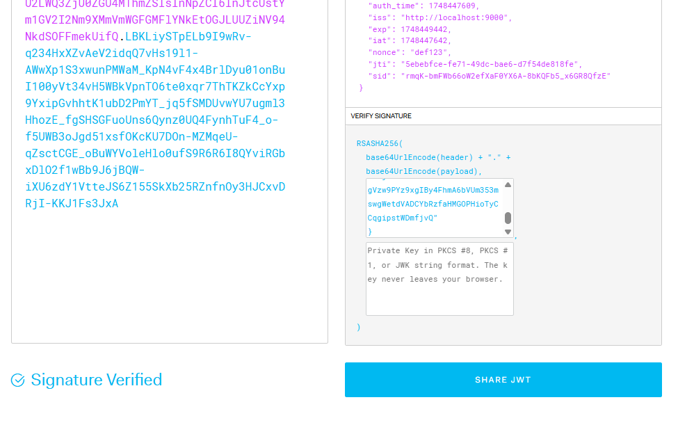


## so now we can apply it to our spring boot app
- move to the other project

# MOVE TO THE auth-client-demo project