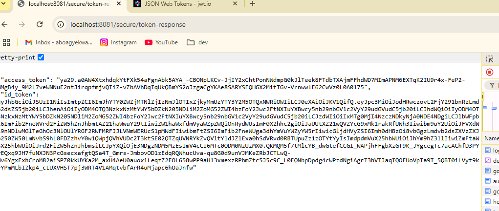
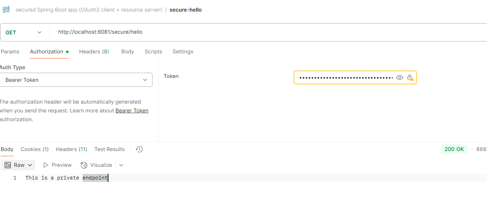
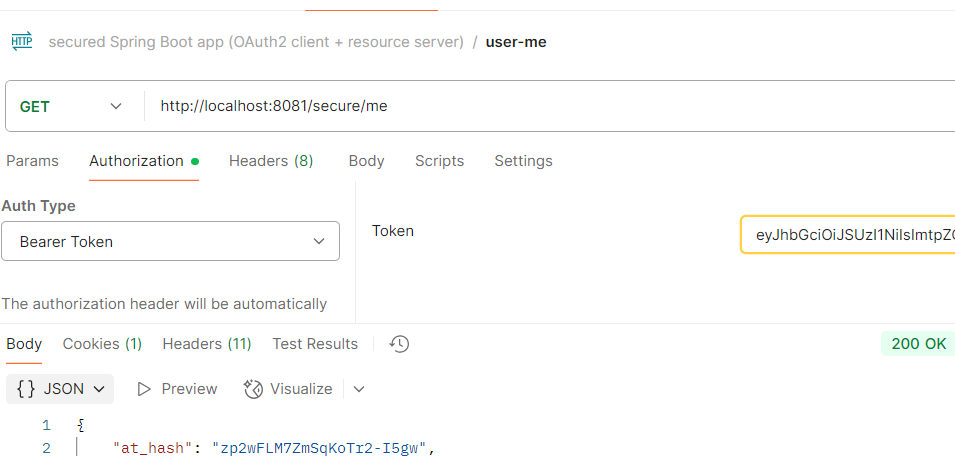

- Dependencies
  - Spring Web 
  - Spring OAuth2 Client
  - Spring OAuth2 Resource Server
  - lombok

- Configure Google API Console
  - create a project , called `Spring Boot OAuth2 Demo`
  - APIs & Services > OAuth consent screen
    - app name, `Spring Boot OAuth2 Demo` 
    - External Audience
  - APIs & Services > Credentials
    - `Web application` application type
    - name: `Frank Spring Boot OAuth2 Client`
    - redirect uri
      - `http://localhost:8081/login/oauth2/code/google`
      - This is the default redirect URI that Spring Security's OAuth2 client uses for Google.
      - copy `client id` and `client secret`
        - mine is:
          - google client id: 82😂44282
          - google client secret: OCx-🤭🤭
      - you can equally download the json

- Configure Spring Security in application.yml
  - (Configuring as a client that logs users in via Google)
  - (Configures the app to act as a resource server using Google-issued JWT tokens)
    - [./src/main/resources/application.yml](./src/main/resources/application.yml)

- Configure Spring Security (Resource Server)
  - (Configuring the app to secure APIs with OAuth2 Bearer Tokens (JWTs))


- Note
```text
- take note of the configs
    - you might get 
Request details: redirect_uri=http://localhost:8081/login/oauth2/code/my-google flowName=GeneralOAuthFlow

from something like this

 registration:
          my-google:
            ...
        provider:
          my-google: 
            ...
```

| Method | Path                     | Description           |
| ------ | ------------------------ | --------------------- |
| GET    | `/`                      | Basic welcome message |
| GET    | `/public`                | Public route          |
| GET    | `/public/logout-success` | Logout confirmation   |

- Require Auth

| Method | Path                     | Description                        |
| ------ | ------------------------ | ---------------------------------- |
| GET    | `/secure/hello`          | Secured static message             |
| GET    | `/secure/user`           | Greeting using OIDC user info      |
| GET    | `/secure/token`          | Get only the access token          |
| GET    | `/secure/token-response` | Get access token + ID token (JSON) |
| GET    | `/secure/userinfo`       | All user claims from Google login  |


- Login via Browser 
  - Go to http://localhost:8081/secure/token-response
  - Sign in with Google and copy the id token response.

- Use Token in Postman
```text

Authorization: Bearer YOUR_ID_TOKEN
```







  