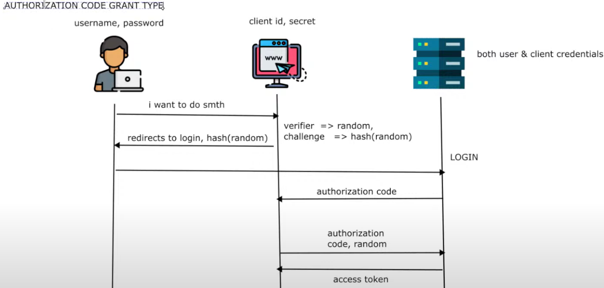
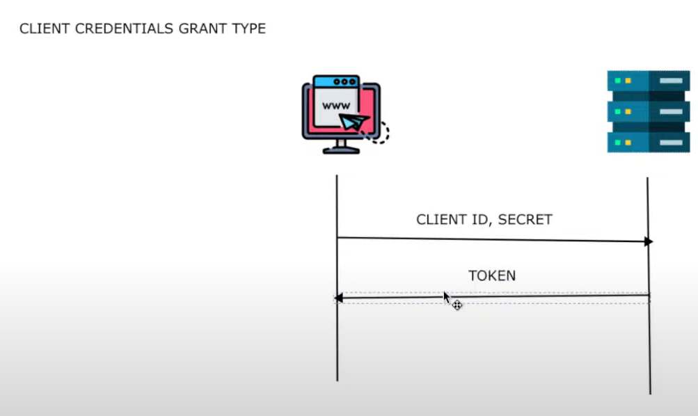
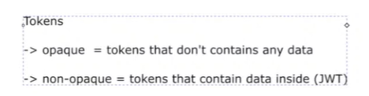

# Continuation From the springsecurity lessons
- by Spilca


## Lesson 9 - OAuth 2 Fundamentals


- Various Grant types


- Authorization code grant type



```text
+-------+          +--------+                                +-------------------+
| User  |          | Client |                                | Authorization     |
|       |          |        |                                |     Server        |
+-------+          +--------+                                +-------------------+
    |                  |                                               |
    | 1. User clicks "Login with X"                                    |
    |----------------->                                                |
    |                  |                                               |
    |                  | 2. Generate code_verifier                     |
    |                  | 3. Create code_challenge = SHA256(verifier)   |
    |                  |                                               |
    |                  | 4. Redirect user to authorization endpoint    |
    |                  |   with:                                       |
    |                  |     - client_id                               |
    |                  |     - redirect_uri                            |
    |                  |     - response_type=code                      |
    |                  |     - code_challenge                          |
    |                  |     - code_challenge_method=S256              |
    |                  |---------------------------------------------->|
    |                  |                                               |
    |                  |                 5. Show login screen          |
    |<--------------------------------------------------------------- |
    | 6. User enters credentials                                       |
    |----------------->                                                |
    |                  |                                               |
    |                  |        7. Ask user to authorize               |
    |<--------------------------------------------------------------- |
    | 8. User clicks "Authorize"                                      |
    |----------------->                                                |
    |                  |                                               |
    |                  | 9. Send back authorization code to client     |
    |                  |   via redirect_uri                            |
    |<--------------------------------------------------------------- |
    |                  |                                               |
    |                  | 10. Client sends token request to auth server |
    |                  |   with:                                       |
    |                  |     - grant_type=authorization_code           |
    |                  |     - code                                    |
    |                  |     - redirect_uri                            |
    |                  |     - code_verifier                           |
    |                  |---------------------------------------------->|
    |                  |                                               |
    |                  | 11. Auth Server verifies:                     |
    |                  |     SHA256(code_verifier) == code_challenge   |
    |                  |                                               |
    |                  | 12. If valid, return:                         |
    |                  |     - access_token                            |
    |                  |     - id_token (if OIDC)                      |
    |<--------------------------------------------------------------- |
    |                  |                                               |
    |                  | 13. Client uses token to access API (Resource Server)
    |                  |---------------------------------------------->|

```

- Client Credentials Grant type




- Refresh Token

```text
+--------+                                          +-------------------+
| Client |                                          | Authorization     |
|        |                                          |     Server        |
+--------+                                          +-------------------+
    |                                                       |
    | 1. Client already has:                                 |
    |     - refresh_token (from initial auth code flow)      |
    |     - access_token (possibly expired or near expiry)   |
    |                                                       |
    | 2. Client detects expired/expiring access_token        |
    |                                                       |
    | 3. Send token refresh request to token endpoint        |
    |    POST /token                                         |
    |    with:                                               |
    |      - grant_type=refresh_token                        |
    |      - refresh_token=<the_refresh_token>               |
    |      - client_id                                       |
    |      - client_secret (if confidential client)          |
    |------------------------------------------------------->|
    |                                                       |
    | 4. Server validates:                                   |
    |     - the refresh_token                                |
    |     - client_id & client_secret (if needed)            |
    |                                                       |
    | 5. If valid, server returns:                           |
    |     - new access_token                                 |
    |     - (optional) new refresh_token                     |
    |<-------------------------------------------------------|
    |                                                       |
    | 6. Client uses new access_token to call Resource Server|
    |------------------------------------------------------->|

```

- Tokens



- Token Instrospection


```text

Token Introspection
Token introspection is an OAuth 2.0 specification that defines a way for resource servers to query the authorization server to get metadata about a token.

```

- Non Opaque Token

```text
A non-opaque token like a JWT (JSON Web Token) contains structured information called claims inside it 

- A JWT is composed of three parts, each base64url-encoded and separated by dot


```

```java
HEADER.PAYLOAD.SIGNATURE
```

```bash

HEADER
    - alg
    - type

PAYLOAD (claims)
    - iss (Issuer)
    - sub (Subject)
    - aud (Audience)
    - exp (Expiration Time)
    - nbf (Not Before)
    - iat (Issued At)
    - jti (JWT ID)

SIGNATURE
    - Created by signing the encoded header and payload with a secret or private key

```
